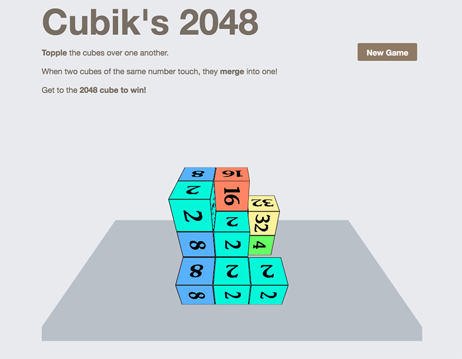

# Cubiks 2048 for YunoHost

[](https://dash.yunohost.org/appci/app/cubiks-2048)    
[](https://install-app.yunohost.org/?app=cubiks-2048)

*[Lire ce readme en français.](./README_fr.md)*

> *This package allow you to install Cubiks 2048 quickly and simply on a YunoHost server. 
If you don’t have YunoHost, please see [here](https://yunohost.org/#/install) to know how to install and enjoy it.*

## Overview

Clone of 2048 game in 3D

## Screenshots



## Demo

* [Official demo](https://kshitij-banerjee.github.io/Cubiks-2048/)

#### Supported architectures

* x86-64 - [](https://ci-apps.yunohost.org/ci/apps/cubiks-2048/)
* ARMv8-A - [](https://ci-apps-arm.yunohost.org/ci/apps/cubiks-2048/)

## Links

 * Report a bug: https://github.com/YunoHost-Apps/Cubiks-2048_ynh/issues
 * Upstream app repository: https://github.com/Kshitij-Banerjee/Cubiks-2048
 * YunoHost website: https://yunohost.org/

---

## Developers info

Please do your pull request to the [testing branch](https://github.com/YunoHost-Apps/Cubiks-2048_ynh/tree/testing).

To try the testing branch, please proceed like that.
```
sudo yunohost app install https://github.com/YunoHost-Apps/Cubiks-2048_ynh/tree/testing --debug
or
sudo yunohost app upgrade cubiks-2048 -u https://github.com/YunoHost-Apps/Cubiks-2048_ynh/tree/testing --debug
```
